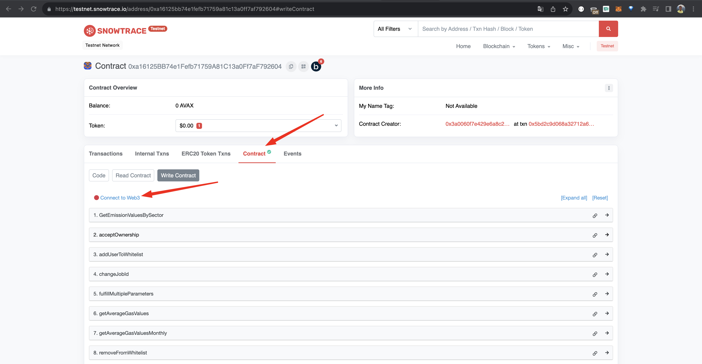

# Hyphen Climate Portal


## Vision & Purpose

The blockchain world is growing fast, and so is the need for reliable data. The success of DeFi is a great example. It boomed because of reliable oracles that provided important price data. Inspired by this, our Greenhouse Gas Oracle has a simple but powerful mission: to give timely and correct data about greenhouse gas emissions to everyone in the blockchain community. We hope that our oracles will become a key tool for new protocols to build their infrastructure based on our oracles. It's not just a data source; it's a step towards a world where blockchain helps make our planet greener and clearer.

## Introduction

Welcome to the documentation for Hyphen's smart contract designed to access greenhouse gas emissions data. This contract was developed to provide decentralized access to greenhouse gas emissions data from various stations around the world. It uses the Chainlink Direct Request model to retrieve data from the backend and deliver it to the user.

A key feature of our contract is its triple-node system. Each time a request is made to the contract, it is simultaneously sent to three nodes managed by three independent companies: Glink, Nord West Nodes, and Hyphen. Two out of three responses must match for the result to be deemed valid, ensuring a high degree of reliability and decentralization in our system.

This documentation provides a comprehensive guide on how to use our contract, including the necessary parameters for each request and examples of use with JavaScript and through the Snowtrace block explorer's graphical interface.

## Contract Overview

Our smart contract operates on an asynchronous data request model. This means that users call a function to request data, and then wait for a response from our nodes (Read more about this in "Request Hash Generation System" section).

We offer three main functions for data requests:

`GetEmissionValuesBySector(dataset, sectorName, gasName, year, month, latitude, longitude)`

This function retrieves greenhouse gas emissions values provided by the Copernicus provider. Users need to specify the dataset, sector name, gas name, year, month, and geographical coordinates (latitude and longitude).

`getAverageGasValues(_stationName, _year, _month, _day)`

This function is used to request historical gas emissions data provided by ICOS provider. Users need to provide the station name and the date in the format: year, month, day.

`getAverageGasValuesMonthly(_stationName, _year, _month)`

This function retrieves the average monthly gas emissions data for a particular station provided by ICOS provider. Users need to specify the station name and the desired year and month.

Each of these functions returns a unique request identifier in the form of a byte string (bytes). This allows users to send multiple requests at once without waiting for a response from the nodes and track responses by this identifier.

After receiving a response to a request, you can retrieve this data using the following function:

`getLatestResult()`

This allows you to retrieve the data of the latest request.

## Contract Usage Options

Hyphen offers two main options for using our smart contract, depending on the payment plan you choose:

### Pay-per-call

In this option, each time you interact with our contract, you pay a fee. The current fee is set at 0.1 AVAX.

### Off-chain subscription

After purchasing an off-chain subscription, your address will be whitelisted, allowing you to make requests by only paying for gas.

**Note!**: Currently, we are operating in a free mode for a trial period. In this mode, users only pay the gas fee when calling the request functions. This is an excellent opportunity for those who want to try our service without any financial commitments.

## iteracting with contract via Snowtrace (Avalanche Network Explorer)

### Visit Snowtrace

Open your browser and navigate to the Snowtrace website.


### Find our Contract and connect your Wallet

In the search bar on the main page, enter our contract's address and hit "Enter" on your keyboard.

To interact with the contract, you'll need to connect your wallet. To do this, click on the wallet icon in the top right corner of the page and select "Metamask" from the dropdown list. Follow the instructions for connection.



### Chose MetaMask


### Interact with the Contract

In the "Contract" tab, you'll see a list of all available contract functions. You can select a function, enter the necessary parameters, and click "Write" to execute a transaction or "Read" to read data.

### Request average gas value monthly


### Request specific daily average gas values


### Request emission values by sector


Remember that all transactions on the Avalanche blockchain require gas fees, so make sure you have enough AVAX in your account to cover these fees.

## Processing Results

When interacting with the Hyphen contract and its backend, understanding the structure and meaning of the results is crucial. Here's a breakdown of the key points to note and some details on how to process the results:

### Request Statuses:

1.  **Pending**: The request is in progress, and results haven't been returned yet.

2.  **Success**: The request successfully returned data.

3.  **Error**: An error occurred during the request.

### Data Retrieval:

-   The endpoints `getAverageGasValuesMonthly` and `getAverageGasValues` return results for all four gas types: CO2, CO, CH4, and N2O. Therefore, you don't need to specify a particular gas when making a request.

-   The endpoint `GetEmissionValuesBySector`, on the other hand, only provides results for the gas you've queried. For other gas types, it returns a value of 0.

### Error Handling:

-   If an error occurs during data retrieval, the value -999 is returned. It's essential to check for this value and handle it accordingly in your application.

-   A returned value of 0 indicates that data for a specific gas type wasn't requested.

-   Any other returned value signifies successful data retrieval.

### Multiplier:

Solidity, the programming language of Ethereum smart contracts, does not natively support float numbers, i.e., numbers with decimal points like 2.4214. To overcome this limitation, our contract now returns a parameter named `multiplier` along with the main data. This `multiplier` is determined based on the maximum number of decimal places among the returned gas values.

For example, consider the following gas emission values: 2.1, 3.421, and 4.58. Here, the maximum number of decimal places is 3 (from the number 3.421). Therefore, the `multiplier` would be 1000. All the returned values will be multiplied by this `multiplier` to transform them into integers. As a result, the above values would be returned as 2100, 3421, and 4580, respectively.

When working with the contract's returned data, remember to divide the values by the `multiplier` to get the original float values.


**Parameter Descriptions:**

-   **lastRequestHash (bytes32)**: A unique identifier for the last data request made to the contract. It's an encoded value that can be used to track or verify specific requests.
-   **lastTimestamp (uint256)**: The Unix timestamp indicating when the last request was made. It represents the number of seconds since the Unix epoch (January 1, 1970).
-   **lastRequestStatus (string)**: The status of the last request. It can be 'Success', 'Pending', or 'Error'.
-   **lastStationName (string)**: The name of the station or location for which the last request was made.
-   **lastMethodName (string)**: Specifies the method or endpoint that was used for the last request.
-   **lastMultipliedParametr (int256)**: The multiplier used to get the actual gas value in its original format.
-   **lastCh4Value (int256)**: The value of methane (CH4) gas retrieved in the last request.
-   **lastCo2Value (int256)**: The value of carbon dioxide (CO2) gas retrieved in the last request.
-   **lastN2oValue (int256)**: The value of nitrous oxide (N2O) gas retrieved in the last request.
-   **lastCoValue (int256)**: The value of carbon monoxide (CO) gas retrieved in the last request.

## Request Hash Generation System

The `Request Hash Generation` system is an integral part of this contract's operations when interacting with Chainlink nodes. Each request made to a Chainlink node generates a unique request hash. But why is this hash crucial?

### Asynchronous Requests

The requests made in this system are inherently asynchronous. It's vital to understand that you initiate a transaction by sending a request in one transaction. However, the response is obtained in a completely different transaction, which is initiated by the Chainlink node after retrieving values from the API.

> **Important Note**: Responses from Chainlink nodes typically arrive within 10-30 seconds. The hashing system allows you not to wait for responses sequentially. Instead, you can send multiple requests within seconds and subsequently receive bundled answers to your queries.

For instance, when you form a request using one of the following functions:

-   `GetEmissionValuesBySector`

-   `getAverageGasValuesMonthly`

-   `getAverageGasValues`

Each of these functions will generate and return a unique request hash upon execution.

### Benefits

1.  **High-speed Asynchronous System**: This hashing mechanism enables a high-throughput asynchronous system. By knowing your request hash, you can swiftly retrieve the results without waiting for the sequential arrival of responses.

2.  **Persistent Response Storage**: The contract also serves as a repository of all responses. Knowing all the hashes of the requests you've dispatched, you can revisit and view all the answers associated with those hashes, even at a later time.

## Interacting with the Contract via JavaScript

To interact with our contract using JavaScript, utilize the ethers.js library.

### Required Dependencies

If you haven't installed ethers.js yet, you can do so with npm:

```bash
npm install ethers
```

### Initialize ethers

```javascript
const ethers = require("ethers");
const provider = new ethers.providers.JsonRpcProvider("https://api.avax-test.network/ext/bc/C/rpc");
```

### Connect to Our Contract

First, you will need the ABI (Application Binary Interface) of the contract. You can fetch it directly from Snowtrace using the link below:

https://api-testnet.snowtrace.io/api?module=contract&action=getabi&address=0xa16125bb74e1fefb71759a81c13a0ff7af792604&format=raw
Note: paste latest actual contract address

After retrieving the ABI, insert it into the `contractABI` placeholder:

```javascript
const contractABI = /* Copy and paste the Contract ABI from Snowtrace here */;
const contractAddress = "0xa16125bb74e1fefb71759a81c13a0ff7af792604";
const hyphenBlockchainEndpointsContract = new ethers.Contract(contractAddress, contractABI, provider);
```

### Call Contract Functions

You can now communicate with the contract's functions as demonstrated in the examples below.

**For Emission Values by Sector**:

```javascript
const tx = await hyphenBlockchainEndpointsContract.GetEmissionValuesBySector(
    "CAMS Global emission inventories",
    "sum",
    "CO2",
    "2005",
    "6",
    "-77.85",
    "166.35",
    {
        gasLimit: ethers.utils.hexlify(1500000),
        gasPrice: ethers.utils.parseUnits("35", "gwei"),
    },
);

await tx.wait();
```

**For Monthly Average Gas Values**:

```javascript
const transaction = await hyphenBlockchainEndpointsContract.getAverageGasValuesMonthly("WIS", "2005", "1", {
    value: ethers.utils.parseEther("0.0001"),
    gasLimit: ethers.utils.hexlify(1500000),
    gasPrice: ethers.utils.parseUnits("35", "gwei"),
});

await transaction.wait();
```

**For Specific Daily Average Gas Values**:

```javascript
const transaction = await hyphenBlockchainEndpointsContract.getAverageGasValues("WIS", "2005", "1", "7", {
    gasLimit: ethers.utils.hexlify(1500000),
    gasPrice: ethers.utils.parseUnits("35", "gwei"),
});

await transaction.wait();
```

### Retrieve Results

1. Using the `getResultBySentHash` function:

The most reliable and recommended way to retrieve data is by querying results using the hash you received upon initiating your data request. This ensures a precise match between your query and the data retrieved.

```javascript
const result = await hyphenBlockchainEndpointsContract.lastSentHash();
const result2 = await hyphenBlockchainEndpointsContract.getResultBySentHash(result);

console.log(result2);
```

2. As a demo alternative, use the `getLatestResult` function:

```javascript
const latestResult = await hyphenBlockchainEndpointsContract.getLatestResult();
console.log("Latest result:", latestResult);
```

### Event Handling with Node.js

Additionally, you can configure backend notifications to listen to events when the Chainlink node sends a response associated with your hash. This way, you stay informed in real-time. To process these events on your backend, you can use the following Node.js snippet to handle the emitted events:

```javascript
// Listen for `MultipleParametrsFulfilled` events
hyphenBlockchainEndpointsContract.events
    .MultipleParametrsFulfilled(
        {
            filter: {
                /* your filters if any */
            },
            fromBlock: "latest",
        },
        function (error, event) {
            if (error) console.error(error);
            console.log(event);
        },
    )
    .on("connected", function (subscriptionId) {
        console.log(subscriptionId);
    })
    .on("data", function (event) {
        console.log(event); // Log the full event
    })
    .on("error", console.error);
```

This script will keep listening for the `MultipleParametrsFulfilled` event and log the details when such an event is emitted. By integrating this into your backend, you can ensure real-time data processing and possibly trigger other operations or notifications based on the event data.

## Issues and Solutions

During your interaction with our contract, you may encounter some challenges. In this section, we will discuss the most common ones and provide possible solutions.

### Insufficient gas for transaction

If you receive an error message indicating that you have insufficient gas for the transaction, it means that your account doesn't have enough AVAX to cover the fees. You can purchase AVAX on any cryptocurrency exchange and transfer it to your wallet.

### Transaction successful, but data not updated

If you notice that the transaction was successful but the data was not updated, it could be due to an incorrect or non-existent stationName or an invalid date. In this case, the transaction will be executed, but no data will be returned, and the values on the contract will not be updated. We are working on finding a way to display such information to the user.

### Cannot find the desired contract function

If you cannot find the desired contract function, make sure that you are using the correct contract and viewing its latest version. If the issue persists, please contact us for assistance!

---

Please note that the stationName can be specified in both lowercase and uppercase. We will soon provide a complete list of all available stations and dates that can be used for historical queries.

We would like to emphasize that our project is still in active development, and the final design and functionality of the contracts may change. We are always open to dialogue and ready to adapt our platform according to the needs of our clients, including the development of custom contracts to meet specific requirements. If you have any questions or suggestions, feel free to reach out to us.

## Conclusion

In this guide, we have explored how to interact with our contract for accessing greenhouse gas emissions data. You have learned how to initiate data requests, check the status of requests, and obtain the results of those requests.

This is an innovative project aimed at providing a simple and accessible method for accessing greenhouse gas emissions data. We are constantly working on improving our contract and welcome any suggestions or feedback that can help us in this endeavor.

Please note that using our contract involves paying a gas fee in AVAX for each function call. The payment options and fee amount may vary depending on network congestion and subscription plans.

Thank you for using our product! We hope it proves valuable in your work or research. If you have any questions or issues, feel free to reach out to us for assistance.
